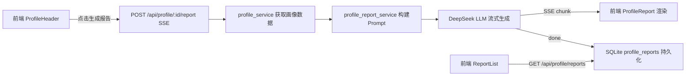
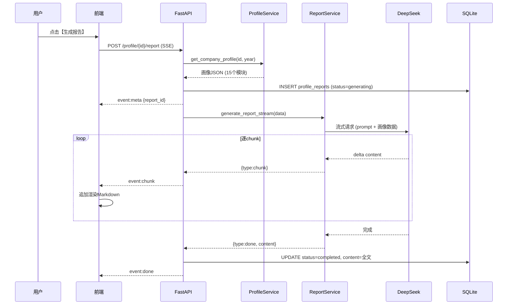

# 企业画像分析报告功能 — 业务与技术文档

## 一、功能概述

企业画像分析报告功能基于LLM（DeepSeek大语言模型），将企业画像页面的全量结构化数据一次性送入模型，自动生成涵盖14个维度的专业企业经营与财税分析报告。报告支持SSE流式生成、历史管理、打印及PDF下载。

## 二、核心功能

- **一键生成**：企业画像页右上角【生成报告】按钮，自动采集当前企业全量画像数据
- **流式输出**：SSE实时推送，报告内容逐步渲染，生成过程可视
- **历史管理**：【查看报告】进入报告列表，支持查看、删除，按权限隔离
- **打印/PDF**：已完成报告支持浏览器打印及"另存为PDF"，自动隐藏导航等非内容区域
- **风险声明**：报告页顶部固定展示AI生成声明与风险提示

## 三、系统架构

## 四、报告生成流程

## 五、API接口

| 方法 | 路径 | 说明 | 权限 |
|------|------|------|------|
| POST | `/api/profile/{id}/report?year=` | 生成报告（SSE流式） | JWT + 企业授权 |
| GET | `/api/profile/reports?taxpayer_id=&page=&size=` | 报告列表（分页） | sys/admin全部，其他仅自己 |
| GET | `/api/profile/reports/{report_id}` | 获取单个报告 | sys/admin或报告所有者 |
| DELETE | `/api/profile/reports/{report_id}` | 删除报告 | sys/admin或报告所有者 |

## 六、数据存储

`profile_reports` 表（SQLite）：

| 字段 | 类型 | 说明 |
|------|------|------|
| id | INTEGER PK | 自增主键 |
| taxpayer_id | TEXT | 纳税人编号 |
| taxpayer_name | TEXT | 纳税人名称 |
| year | INTEGER | 分析年度 |
| user_id / username | INT / TEXT | 提交用户 |
| status | TEXT | generating → completed / failed |
| content | TEXT | 完整Markdown报告 |
| error_msg | TEXT | 失败原因 |
| created_at / completed_at | TIMESTAMP | 提交/完成时间 |

索引：`(taxpayer_id, year)`、`(user_id)`

## 七、报告分析维度（14个模块）

企业身份与股权治理、组织与人力、财务表现、业务运营、购销存/供应链、研发创新、税务表现、跨境业务、合规风险、外部关系、数字化、ESG、政策匹配、特殊业务。末尾输出**企业全景综合结论**（经营健康度、财务状况、税务合规、风险分级、筹划机会、管理建议）。数据缺失的模块自动跳过。

## 八、配置项

| 配置 | 默认值 | 说明 |
|------|--------|------|
| PROFILE_REPORT_ENABLED | True | 功能开关 |
| PROFILE_REPORT_LLM_MODEL | deepseek-chat | LLM模型 |
| PROFILE_REPORT_MAX_TOKENS | 8000 | 最大输出token |
| PROFILE_REPORT_TEMPERATURE | 0.3 | 生成温度 |

## 九、维护与扩展

- **提示词调优**：编辑 `prompts/profile_report.txt`，无需改代码，重启生效
- **新增画像模块**：在 `profile_service.py` 增加数据查询 → 提示词中增加对应分析要求
- **切换LLM**：修改 `config/settings.py` 中模型配置即可（OpenAI兼容接口）
- **报告清理**：可通过DELETE接口或直接操作 `profile_reports` 表清理历史报告
- **路由注册顺序**：`profile_report.router` 必须在 `profile.router` 之前注册，避免 `/api/profile/reports` 被路径参数匹配
