# FinTax AI 智能财税咨询平台

**产品说明文档**

**版本**: 2.0
**日期**: 2026年3月18日
**面向用户**: 企业用户、税务顾问、系统管理员

---

## 目录

1. [产品概述](#1-产品概述)
2. [系统架构](#2-系统架构)
3. [核心功能](#3-核心功能)
4. [数据与信息](#4-数据与信息)
5. [关键技术实现](#5-关键技术实现)
6. [API接口文档](#6-api接口文档)
7. [用户场景与痛点解决](#7-用户场景与痛点解决)
8. [系统安全与权限](#8-系统安全与权限)
9. [性能优化](#9-性能优化)
10. [部署与配置](#10-部署与配置)
11. [系统维护与扩展](#11-系统维护与扩展)
12. [常见问题](#12-常见问题)

---

## 1. 产品概述

### 1.1 产品定位

FinTax AI 是一款面向中国企业的**智能税务与财务咨询平台**，通过自然语言处理技术，将复杂的财税数据查询转化为简单的对话交互。系统采用两阶段 NL2SQL（自然语言转SQL）技术，结合大语言模型（LLM）的语义理解能力和结构化数据库的精确查询能力，为企业提供实时、准确的财税数据分析服务。

### 1.2 核心价值主张

| 价值维度 | 具体描述 |
|---------|---------|
| **降低专业门槛** | 非财税专业人员也能快速获取财税数据，无需学习复杂的报表结构和税法条款 |
| **提升决策效率** | 秒级响应查询，支持多轮对话快速获得所需信息 |
| **数据准确可靠** | 基于结构化SQLite数据库存储，确保查询结果准确无误，避免大模型幻觉 |
| **全域数据整合** | 整合增值税、企业所得税、财务报表、发票、财务指标等9大数据域 |
| **智能税务筹划** | 结合1522条税收优惠政策库和外部法规知识库，提供综合税务建议 |

### 1.3 技术特点

- **四路由智能架构**：财务数据查询、税收优惠检索、法规知识库、混合分析四大路由智能分流
- **两阶段NL2SQL**：Stage 1 意图解析 + Stage 2 SQL生成，确保查询准确性
- **确定性计算路径**：财务指标和概念查询无需LLM参与，直接SQL+Python计算
- **多轮对话支持**：支持上下文继承和跨路由综合分析，实现连续对话体验
- **双层缓存机制**：L1结果缓存 + L2模板缓存，大幅提升响应速度
- **SSE流式输出**：实时流式响应，提升用户体验

### 1.4 目标用户

| 用户类型 | 核心需求 | 典型使用场景 |
|---------|---------|-------------|
| **企业财务人员** | 日常财税数据查询、报表分析、税负计算 | "华兴科技2025年1月增值税销项税额是多少？" |
| **税务顾问/事务所** | 多客户管理、税务筹划方案、合规检查 | 对比分析多家客户的税负情况 |
| **集团企业财务总监** | 多子公司数据对比、集团财务分析 | 汇总分析旗下各子公司的财务状况 |
| **企业管理层** | 经营决策支持、财务健康度监控 | 查看企业健康评分和关键财务指标 |
| **系统管理员** | 用户管理、权限配置、系统监控 | 管理系统用户和数据访问权限 |

### 1.5 数据覆盖范围

| 维度 | 覆盖范围 |
|-----|---------|
| **企业数量** | 6家样本企业 |
| **数据域** | 9大核心财税数据域 |
| **时间跨度** | 2023年1月 - 2026年2月 |
| **会计准则** | 企业会计准则(ASBE)、小企业会计准则(ASSE) |
| **纳税人类型** | 一般纳税人、小规模纳税人 |
| **政策数据** | 1522条税收优惠政策 |

---

## 2. 系统架构

### 2.1 整体架构图

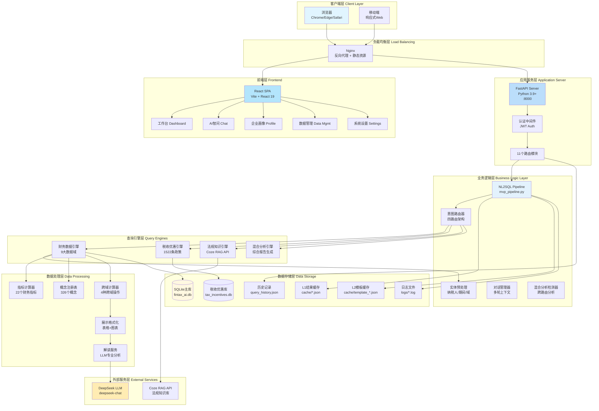
```mermaid
graph TB
    subgraph "客户端层 Client Layer"
        Browser[浏览器<br/>Chrome/Edge/Safari]
        Mobile[移动端<br/>响应式Web]
    end

    subgraph "前端层 Frontend"
        SPA[React SPA<br/>Vite + React 19]
        Dashboard[工作台 Dashboard]
        Chat[AI智问 Chat]
        Profile[企业画像 Profile]
        DataMgmt[数据管理 Data Mgmt]
        Settings[系统设置 Settings]
    end

    subgraph "负载均衡层 Load Balancing"
        Nginx[Nginx<br/>反向代理 + 静态资源]
    end

    subgraph "应用服务层 Application Server"
        API[FastAPI Server<br/>Python 3.9+<br/>:8000]
        Auth[认证中间件<br/>JWT Auth]
        Routers[11个路由模块]
    end

    subgraph "业务逻辑层 Business Logic Layer"
        Pipeline[NL2SQL Pipeline<br/>mvp_pipeline.py]
        IntentRouter[意图路由器<br/>四路由架构]
        EntityPre[实体预处理<br/>纳税人/期间/域]
        ConvManager[对话管理器<br/>多轮上下文]
        MixedAnalyzer[混合分析检测器<br/>跨路由分析]
    end

    subgraph "查询引擎层 Query Engines"
        FinEngine[财务数据引擎<br/>9大数据域]
        TaxEngine[税收优惠引擎<br/>1522条政策]
        RegEngine[法规知识引擎<br/>Coze RAG API]
        MixedEngine[混合分析引擎<br/>综合报告生成]
    end

    subgraph "数据处理层 Data Processing"
        MetricCalc[指标计算器<br/>22个财务指标]
        ConceptReg[概念注册表<br/>326个概念]
        CrossCalc[跨域计算器<br/>4种跨域操作]
        DispFormatter[展示格式化<br/>表格+图表]
        Interpreter[解读服务<br/>LLM专业分析]
    end

    subgraph "数据存储层 Data Storage"
        MainDB[(SQLite主库<br/>fintax_ai.db)]
        TaxDB[(税收优惠库<br/>tax_incentives.db)]
        L1Cache[L1结果缓存<br/>cache/*.json]
        L2Cache[L2模板缓存<br/>cache/template_*.json]
        History[历史记录<br/>query_history.json]
        Logs[日志文件<br/>logs/*.log]
    end

    subgraph "外部服务层 External Services"
        DeepSeek[DeepSeek LLM<br/>deepseek-chat]
        CozeRAG[Coze RAG API<br/>法规知识库]
    end

    Browser --> Nginx
    Mobile --> Nginx
    Nginx --> SPA
    Nginx --> API
    SPA --> Dashboard
    SPA --> Chat
    SPA --> Profile
    SPA --> DataMgmt
    SPA --> Settings
    API --> Auth
    Auth --> Routers
    Routers --> Pipeline
    Pipeline --> IntentRouter
    IntentRouter --> FinEngine
    IntentRouter --> TaxEngine
    IntentRouter --> RegEngine
    IntentRouter --> MixedEngine
    FinEngine --> EntityPre
    FinEngine --> MetricCalc
    FinEngine --> ConceptReg
    FinEngine --> CrossCalc
    CrossCalc --> DispFormatter
    DispFormatter --> Interpreter
    Interpreter --> DeepSeek
    FinEngine --> MainDB
    TaxEngine --> TaxDB
    RegEngine --> CozeRAG
    Pipeline --> L1Cache
    Pipeline --> L2Cache
    Routers --> History
    Pipeline --> Logs

    style Browser fill:#e1f5ff
    style SPA fill:#b3e5fc
    style API fill:#bbdefb
    style Pipeline fill:#e3f2fd
    style MainDB fill:#fff8e1
    style DeepSeek fill:#ffecb3
```

### 2.2 技术栈详表

#### 前端技术栈

| 技术选型 | 版本 | 用途说明 |
|---------|------|---------|
| React | 19.x | UI框架 |
| Vite | 7.x | 构建工具 |
| Chart.js + react-chartjs-2 | 最新版 | 图表渲染 |
| react-markdown | 最新版 | Markdown渲染 |
| lucide-react | 最新版 | 图标库 |
| CSS Modules | - | 样式隔离 |

#### 后端技术栈

| 技术选型 | 版本 | 用途说明 |
|---------|------|---------|
| Python | 3.9+ | 运行环境 |
| FastAPI | 最新版 | Web框架 |
| SQLite | 3.35+ | 主数据库 |
| Pydantic | - | 数据验证 |
| python-jose | - | JWT处理 |
| bcrypt | - | 密码加密 |
| uvicorn | - | ASGI服务器 |

#### 外部服务

| 服务 | 用途 | 配置位置 |
|-----|------|---------|
| DeepSeek API | LLM能力 | config/settings.py |
| Coze RAG API | 法规知识库 | config/settings.py |

### 2.3 部署架构

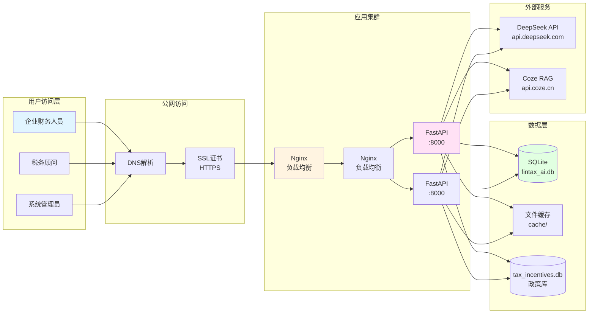
```mermaid
graph LR
    subgraph "用户访问层"
        User1[企业财务人员]
        User2[税务顾问]
        User3[系统管理员]
    end

    subgraph "公网访问"
        DNS[DNS解析]
        SSL[SSL证书<br/>HTTPS]
    end

    subgraph "应用集群"
        Nginx1[Nginx<br/>负载均衡]
        Nginx2[Nginx<br/>负载均衡]
        FastAPI1[FastAPI<br/>:8000]
        FastAPI2[FastAPI<br/>:8000]
    end

    subgraph "数据层"
        SQLite[(SQLite<br/>fintax_ai.db)]
        Cache[文件缓存<br/>cache/]
        PolicyDB[(tax_incentives.db<br/>政策库)]
    end

    subgraph "外部服务"
        LLM[DeepSeek API<br/>api.deepseek.com]
        RAG[Coze RAG<br/>api.coze.cn]
    end

    User1 --> DNS
    User2 --> DNS
    User3 --> DNS
    DNS --> SSL
    SSL --> Nginx1
    Nginx1 --> Nginx2
    Nginx2 --> FastAPI1
    Nginx2 --> FastAPI2
    FastAPI1 --> SQLite
    FastAPI2 --> SQLite
    FastAPI1 --> Cache
    FastAPI2 --> Cache
    FastAPI1 --> PolicyDB
    FastAPI2 --> PolicyDB
    FastAPI1 --> LLM
    FastAPI2 --> LLM
    FastAPI1 --> RAG
    FastAPI2 --> RAG

    style User1 fill:#e1f5ff
    style Nginx1 fill:#fff4e1
    style FastAPI1 fill:#ffe1f5
    style SQLite fill:#e1ffe1
```

### 2.4 前端页面架构


```mermaid
graph TB
    subgraph "App主框架"
        Header[Header头部<br/>Logo + 用户信息]
        Sidebar[Sidebar侧边栏<br/>导航菜单]
        Main[Main Content<br/>主内容区]
    end

    subgraph "工作台 Dashboard"
        D1[健康评分卡<br/>综合评分0-100]
        D2[税负汇总<br/>增值税/所得税/总税负]
        D3[数据质量预警<br/>5类检查项]
        D4[快捷查询<br/>6个快捷按钮]
        D5[最近查询<br/>最近5条记录]
        D6[客户组合<br/>多企业管理]
    end

    subgraph "AI智问 Chat"
        C1[对话输入框<br/>发送按钮]
        C2[对话历史面板<br/>消息列表]
        C3[结果展示区<br/>表格/图表/解读]
        C4[路由指示器<br/>显示当前路由]
        C5[思考模式切换<br/>quick/think/deep]
    end

    subgraph "企业画像 Profile"
        P1[基本信息<br/>企业工商信息]
        P2[股东结构<br/>股东列表/持股]
        P3[人力资源<br/>员工/研发人员]
        P4[资产结构<br/>资产/负债分析]
        P5[利润数据<br/>营收/成本/利润]
        P6[现金流<br/>经营/投资/筹资]
        P7[财务指标<br/>ROE/资产负债率等]
        P8[税务汇总<br/>各税种汇总]
        P9[发票统计<br/>进项/销项发票]
        P10[研发创新<br/>研发费用/强度]
        P11[合规风险<br/>风险指标评估]
    end

    subgraph "数据管理 Data Management"
        M1[单企业数据<br/>数据统计/质量]
        M2[多企业对比<br/>批量对比分析]
        M3[数据浏览器<br/>10个可浏览域]
        M4[质量检查<br/>5类检查报告]
    end

    subgraph "系统设置 Settings"
        S1[用户管理<br/>CRUD/角色分配]
        S2[会话管理<br/>活跃会话监控]
        S3[基础设置<br/>系统参数配置]
        S4[服务配置<br/>LLM/API配置]
    end

    Header --> Sidebar
    Sidebar --> Main
    Main --> D1
    Main --> D2
    Main --> D3
    Main --> D4
    Main --> D5
    Main --> D6
    Main --> C1
    Main --> C2
    Main --> C3
    Main --> C4
    Main --> C5
    Main --> P1
    Main --> P2
    Main --> P3
    Main --> P4
    Main --> P5
    Main --> P6
    Main --> P7
    Main --> P8
    Main --> P9
    Main --> P10
    Main --> P11
    Main --> M1
    Main --> M2
    Main --> M3
    Main --> M4
    Main --> S1
    Main --> S2
    Main --> S3
    Main --> S4

    style Header fill:#e1f5ff
    style Sidebar fill:#b3e5fc
    style Main fill:#bbdefb
```

---

## 3. 核心功能

### 3.1 功能模块总览

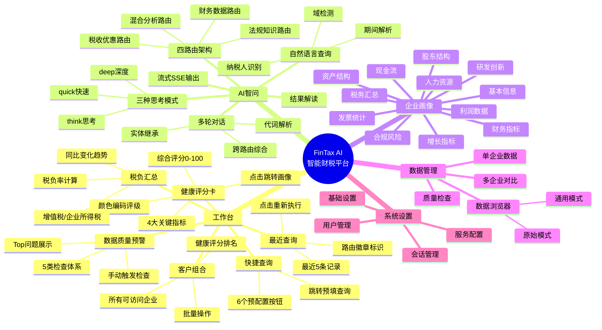
```mermaid
mindmap
  root((FinTax AI<br/>智能财税平台))
    工作台
      健康评分卡
        综合评分0-100
        4大关键指标
        颜色编码评级
        点击跳转画像
      税负汇总
        增值税/企业所得税
        税负率计算
        同比变化趋势
      数据质量预警
        5类检查体系
        Top问题展示
        手动触发检查
      快捷查询
        6个预配置按钮
        跳转预填查询
      最近查询
        最近5条记录
        路由徽章标识
        点击重新执行
      客户组合
        所有可访问企业
        健康评分排名
        批量操作
    AI智问
      自然语言查询
        纳税人识别
        期间解析
        域检测
      四路由架构
        财务数据路由
        税收优惠路由
        法规知识路由
        混合分析路由
      多轮对话
        实体继承
        代词解析
        跨路由综合
      三种思考模式
        quick快速
        think思考
        deep深度
      流式SSE输出
      结果解读
    企业画像
      基本信息
      股东结构
      人力资源
      资产结构
      利润数据
      现金流
      增长指标
      财务指标
      税务汇总
      发票统计
      研发创新
      合规风险
    数据管理
      单企业数据
      多企业对比
      数据浏览器
        通用模式
        原始模式
      质量检查
    系统设置
      用户管理
      会话管理
      基础设置
      服务配置
```

### 3.2 AI智问 - 查询路由系统

#### 3.2.1 四路由架构详解

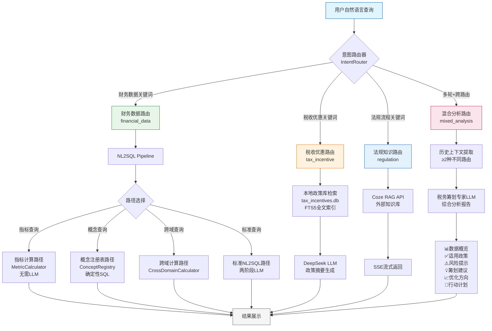
```mermaid
graph TD
    A[用户自然语言查询] --> B{意图路由器<br/>IntentRouter}

    B -->|财务数据关键词| C[财务数据路由<br/>financial_data]
    B -->|税收优惠关键词| D[税收优惠路由<br/>tax_incentive]
    B -->|法规流程关键词| E[法规知识路由<br/>regulation]
    B -->|多轮+跨路由| F[混合分析路由<br/>mixed_analysis]

    C --> C1[NL2SQL Pipeline]
    C1 --> C2{路径选择}
    C2 -->|指标查询| C3[指标计算路径<br/>MetricCalculator<br/>无需LLM]
    C2 -->|概念查询| C4[概念注册表路径<br/>ConceptRegistry<br/>确定性SQL]
    C2 -->|跨域查询| C5[跨域计算路径<br/>CrossDomainCalculator]
    C2 -->|标准查询| C6[标准NL2SQL路径<br/>两阶段LLM]

    D --> D1[本地政策库检索<br/>tax_incentives.db<br/>FTS5全文索引]
    D1 --> D2[DeepSeek LLM<br/>政策摘要生成]

    E --> E1[Coze RAG API<br/>外部知识库]
    E1 --> E2[SSE流式返回]

    F --> F1[历史上下文提取<br/>≥2种不同路由]
    F1 --> F2[税务筹划专家LLM<br/>综合分析报告]
    F2 --> F3[📊数据概览<br/>✅适用政策<br/>⚠️风险提示<br/>💡筹划建议<br/>📈优化方向<br/>🎯行动计划]

    C3 --> G[结果展示]
    C4 --> G
    C5 --> G
    C6 --> G
    D2 --> G
    E2 --> G
    F3 --> G

    style A fill:#e1f5ff,stroke:#01579b
    style C fill:#e8f5e9,stroke:#2e7d32
    style D fill:#fff3e0,stroke:#ef6c00
    style E fill:#e3f2fd,stroke:#1565c0
    style F fill:#fce4ec,stroke:#c2185b
    style G fill:#f5f5f5,stroke:#616161
```

#### 3.2.2 路由决策层级

| 层级 | 名称 | 决策逻辑 | 优先级 |
|-----|------|---------|--------|
| Layer -2 | 财务数据优先 | 数据类关键词 + 税种/财务术语同时出现 | 最高 |
| Layer -1 | 知识库优先 | 流程/操作类关键词（指南、申报流程等） | 次高 |
| Layer 0 | 企业数据查询 | 纳税人名称模糊匹配 或 时间+金额模式 | 中 |
| Layer 1 | 税收优惠 | 优惠关键词（减免、抵扣、退税等） | 低 |
| Default | 法规知识 | 无匹配则路由到法规知识库 | 最低 |

#### 3.2.3 混合分析触发条件

当以下**全部条件**满足时，触发混合分析路由：

1. `MIXED_ANALYSIS_ENABLED = True`（配置开关）
2. 用户启用多轮对话（`conversation_depth ≥ 2`）
3. 历史记录非空
4. 历史包含 **≥2种不同路由**（如tax_incentive + financial_data）
5. LLM检测到综合分析需求（关键词：综合、匹配、建议、筹划、优化）

### 3.3 NL2SQL Pipeline 详解

#### 3.3.1 两阶段架构流程

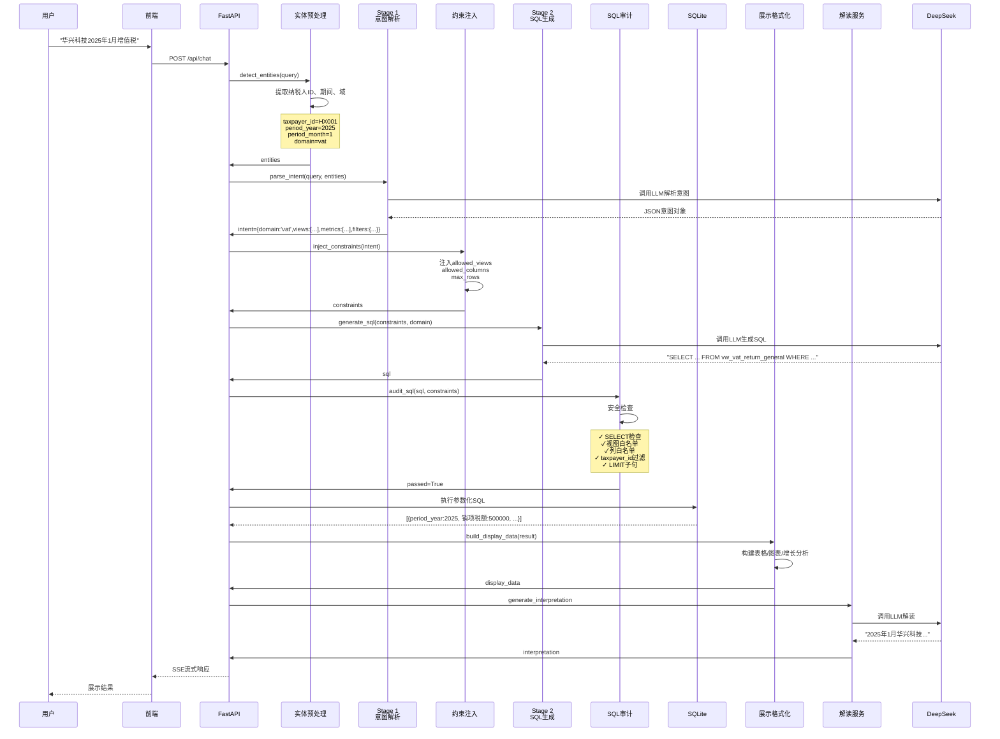
```mermaid
sequenceDiagram
    participant U as 用户
    participant FE as 前端
    participant API as FastAPI
    participant EP as 实体预处理
    participant IP as Stage 1<br/>意图解析
    participant CI as 约束注入
    participant SW as Stage 2<br/>SQL生成
    participant SA as SQL审计
    participant DB as SQLite
    participant DF as 展示格式化
    participant IS as 解读服务
    participant LLM as DeepSeek

    U->>FE: "华兴科技2025年1月增值税"
    FE->>API: POST /api/chat

    API->>EP: detect_entities(query)
    EP->>EP: 提取纳税人ID、期间、域
    Note over EP: taxpayer_id=HX001<br/>period_year=2025<br/>period_month=1<br/>domain=vat
    EP->>API: entities

    API->>IP: parse_intent(query, entities)
    IP->>LLM: 调用LLM解析意图
    LLM-->>IP: JSON意图对象
    IP->>API: intent={domain:'vat',views:[...],metrics:[...],filters:{...}}

    API->>CI: inject_constraints(intent)
    CI->>CI: 注入allowed_views<br/>allowed_columns<br/>max_rows
    CI->>API: constraints

    API->>SW: generate_sql(constraints, domain)
    SW->>LLM: 调用LLM生成SQL
    LLM-->>SW: "SELECT ... FROM vw_vat_return_general WHERE ..."
    SW->>API: sql

    API->>SA: audit_sql(sql, constraints)
    SA->>SA: 安全检查
    Note over SA: ✓ SELECT检查<br/>✓ 视图白名单<br/>✓ 列白名单<br/>✓ taxpayer_id过滤<br/>✓ LIMIT子句
    SA->>API: passed=True

    API->>DB: 执行参数化SQL
    DB-->>API: [{period_year:2025, 销项税额:500000, ...}]

    API->>DF: build_display_data(result)
    DF->>DF: 构建表格/图表/增长分析
    DF->>API: display_data

    API->>IS: generate_interpretation
    IS->>LLM: 调用LLM解读
    LLM-->>IS: "2025年1月华兴科技..."
    IS->>API: interpretation

    API-->>FE: SSE流式响应
    FE-->>U: 展示结果
```

#### 3.3.2 查询路径选择

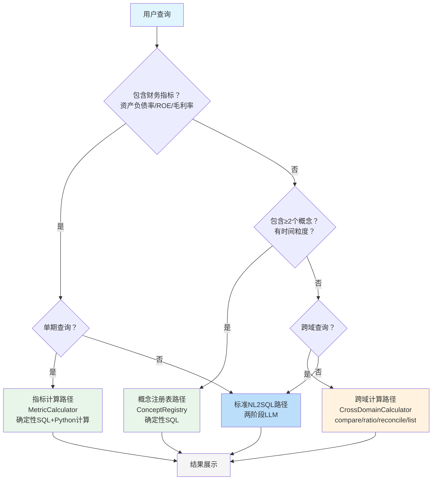
```mermaid
graph TD
    A[用户查询] --> B{包含财务指标？<br/>资产负债率/ROE/毛利率}

    B -->|是| C{单期查询？}
    B -->|否| D{包含≥2个概念？<br/>有时间粒度？}

    C -->|是| E[指标计算路径<br/>MetricCalculator<br/>确定性SQL+Python计算]
    C -->|否| F[标准NL2SQL路径<br/>两阶段LLM]

    D -->|是| G[概念注册表路径<br/>ConceptRegistry<br/>确定性SQL]
    D -->|否| H{跨域查询？}

    H -->|是| I[跨域计算路径<br/>CrossDomainCalculator<br/>compare/ratio/reconcile/list]
    H -->|否| F

    E --> J[结果展示]
    G --> J
    I --> J
    F --> J

    style A fill:#e1f5ff
    style E fill:#e8f5e9
    style G fill:#e8f5e9
    style I fill:#fff3e0
    style F fill:#bbdefb
    style J fill:#f5f5f5
```

### 3.4 确定性计算路径

#### 3.4.1 指标计算路径

适用场景：查询包含财务指标关键词（如"资产负债率"、"ROE"、"毛利率"）且为单期查询


```mermaid
graph LR
    A[检测到指标关键词] --> B[查询指标定义<br/>formula/sources/label/unit]
    B --> C[识别数据源需求<br/>跨域字段]
    C --> D[构建确定性SQL<br/>每个source一条]
    D --> E[执行跨域查询]
    E --> F[Python公式计算<br/>eval沙箱]
    F --> G[返回结果<br/>无需LLM]

    style A fill:#e1f5ff
    style G fill:#e8f5e9
```

**支持的22个财务指标**：

| 类别 | 指标列表 |
|-----|---------|
| 盈利能力 | 毛利率、净利润率、营业利润率、成本费用利润率、ROE、ROA |
| 偿债能力 | 资产负债率、产权比率、权益乘数、流动比率、现金债务保障比率 |
| 营运能力 | 总资产周转率 |
| 结构占比 | 流动资产占比、固定资产占比、流动负债占比、营业成本占比、期间费用占比、研发费用占比、进项税额占比、留抵税额占比 |

#### 3.4.2 概念注册表路径

适用场景：查询包含≥2个财务概念且有时间粒度（月度/季度/年度）


```mermaid
graph LR
    A[检测到≥2个概念] --> B[时间粒度识别<br/>monthly/quarterly/yearly]
    B --> C[概念定义查询<br/>326个概念]
    C --> D[构建确定性SQL<br/>每个概念一条]
    D --> E[批量执行]
    E --> F[结果合并]
    F --> G[返回结果<br/>无需LLM]

    style A fill:#e1f5ff
    style G fill:#e8f5e9
```

**326个概念覆盖**：

| 数据域 | 概念数量 | 示例 |
|-------|---------|------|
| 资产负债表 | 68 | 货币资金、应收账款、存货、固定资产 |
| 利润表 | 61 | 营业收入、营业成本、净利润 |
| 现金流量表 | 35 | 经营活动现金流、投资活动现金流 |
| 增值税 | 30 | 销项税额、进项税额、应纳税额 |
| 企业所得税 | 18 | 应纳税所得额、应纳税额、减免税额 |
| 发票 | 6 | 进项发票、销项发票 |
| 财务指标 | 26 | 各类财务比率 |

### 3.5 跨域查询

支持4种跨域操作类型：

| 操作类型 | 说明 | 示例查询 | 输出格式 |
|---------|------|---------|---------|
| **compare** | 并排展示多个域数据 | "对比华兴科技2025年1月利润和增值税" | 双域并排表格+差异分析 |
| **ratio** | 计算两个域数据的比值 | "华兴科技2025年净利润占营收比重" | A/B比率+百分比 |
| **reconcile** | 检查多域数据一致性 | "核对利润表净利润与资产负债表未分配利润变动" | 一致性检查结果 |
| **list** | 合并多域数据 | "列出华兴科技2025年所有税费" | UNION合并+来源标记 |

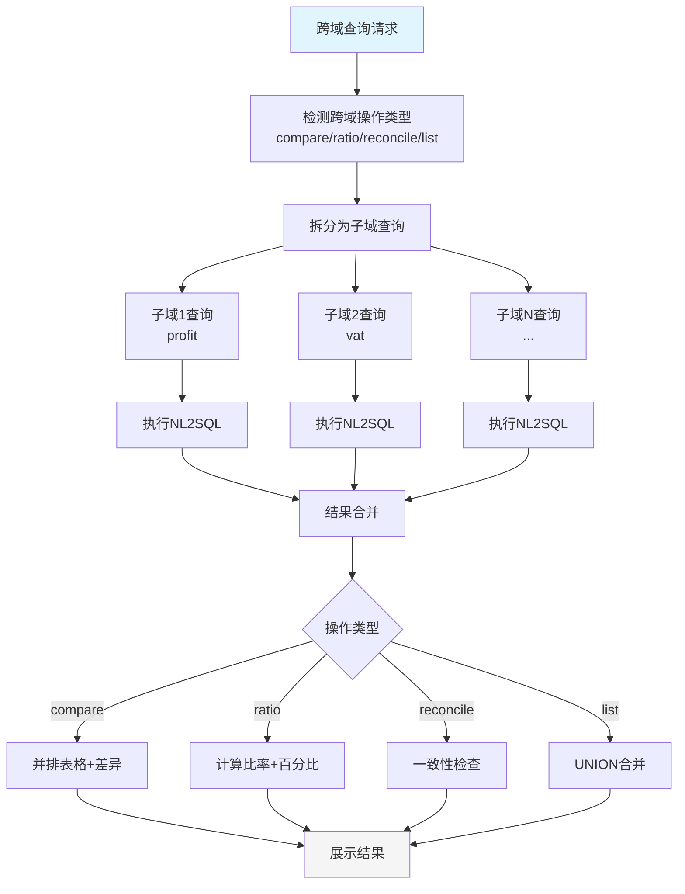
```mermaid
graph TD
    A[跨域查询请求] --> B[检测跨域操作类型<br/>compare/ratio/reconcile/list]
    B --> C[拆分为子域查询]

    C --> C1[子域1查询<br/>profit]
    C --> C2[子域2查询<br/>vat]
    C --> C3[子域N查询<br/>...]

    C1 --> D1[执行NL2SQL]
    C2 --> D2[执行NL2SQL]
    C3 --> D3[执行NL2SQL]

    D1 --> E[结果合并]
    D2 --> E
    D3 --> E

    E --> F{操作类型}
    F -->|compare| F1[并排表格+差异]
    F -->|ratio| F2[计算比率+百分比]
    F -->|reconcile| F3[一致性检查]
    F -->|list| F4[UNION合并]

    F1 --> G[展示结果]
    F2 --> G
    F3 --> G
    F4 --> G

    style A fill:#e1f5ff
    style G fill:#f5f5f5
```

### 3.6 多轮对话系统

#### 3.6.1 两层对话架构

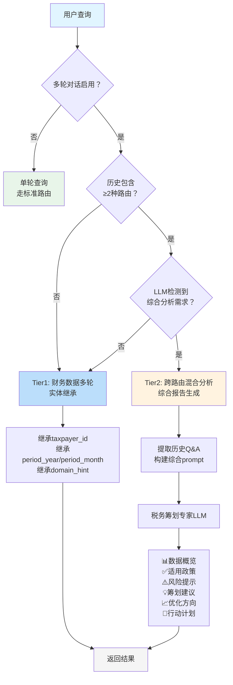
```mermaid
graph TD
    A[用户查询] --> B{多轮对话启用？}

    B -->|否| C[单轮查询<br/>走标准路由]

    B -->|是| D{历史包含<br/>≥2种路由？}

    D -->|否| E[Tier1: 财务数据多轮<br/>实体继承]
    D -->|是| F{LLM检测到<br/>综合分析需求？}

    F -->|否| E
    F -->|是| G[Tier2: 跨路由混合分析<br/>综合报告生成]

    E --> H[继承taxpayer_id<br/>继承period_year/period_month<br/>继承domain_hint]
    H --> I[返回结果]

    G --> J[提取历史Q&A<br/>构建综合prompt]
    J --> K[税务筹划专家LLM]
    K --> L[📊数据概览<br/>✅适用政策<br/>⚠️风险提示<br/>💡筹划建议<br/>📈优化方向<br/>🎯行动计划]
    L --> I

    style A fill:#e1f5ff
    style C fill:#e8f5e9
    style E fill:#bbdefb
    style G fill:#fff3e0
    style I fill:#f5f5f5
```

#### 3.6.2 实体继承规则

| 继承字段 | 继承条件 | 示例 |
|---------|---------|------|
| **taxpayer_id** | 未指定纳税人时 | Turn1:"华兴科技..." → Turn2:"2月呢"（继承华兴科技） |
| **period_year** | 未指定年份时 | Turn1:"2025年..." → Turn2:"利润"（继承2025年） |
| **period_month** | "N月呢"模式 | Turn1:"1月增值税" → Turn2:"2月呢"（提取month=2） |
| **domain_hint** | 域中性查询时 | Turn1:"增值税" → Turn2:"利润是多少"（切换域） |

#### 3.6.3 对话示例

```
Turn 1: 用户:"华兴科技2025年1月增值税"
  → Route: financial_data
  → Returns: 增值税销项税额500,000元

Turn 2: 用户:"2月呢"
  → Route: financial_data（继承taxpayer_id=HX001, period_year=2025）
  → Returns: 增值税销项税额480,000元

Turn 3: 用户:"TSE可以享受哪些税收优惠，请结合上述数据分析"
  → Route: mixed_analysis（检测到≥2种路由+综合关键词）
  → Returns: 综合分析报告
```

### 3.7 三种思考模式

| 模式 | 英文名 | 行为描述 | 响应速度 | LLM调用 |
|-----|--------|---------|---------|--------|
| **快速模式** | quick | 优先返回缓存结果+缓存解读 | 秒级 | 无 |
| **思考模式** | think | 返回缓存结果+重新生成解读 | 较快 | 仅解读 |
| **深度模式** | deep | 绕过所有缓存，完整重跑pipeline | 较慢 | 完整调用 |

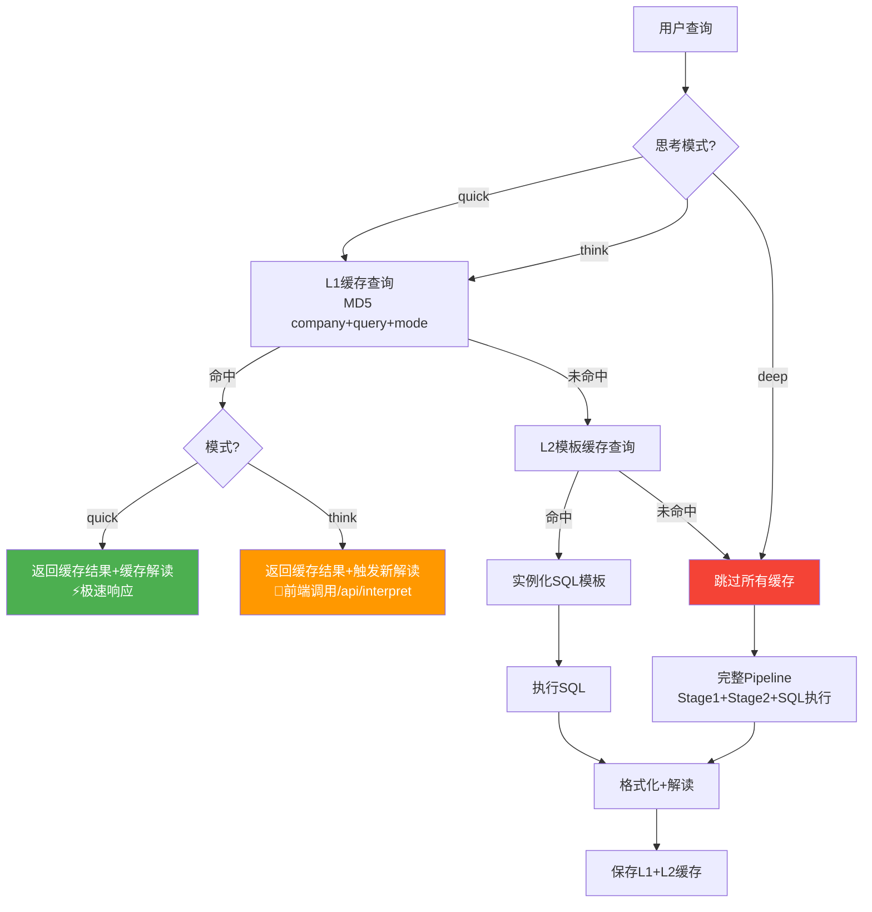
```mermaid
graph TD
    A[用户查询] --> B{思考模式?}

    B -->|quick| C[L1缓存查询<br/>MD5 company+query+mode]
    B -->|think| C
    B -->|deep| H[跳过所有缓存]

    C -->|命中| D{模式?}
    C -->|未命中| E[L2模板缓存查询]

    D -->|quick| F[返回缓存结果+缓存解读<br/>⚡极速响应]
    D -->|think| G[返回缓存结果+触发新解读<br/>🔄前端调用/api/interpret]

    E -->|命中| I[实例化SQL模板]
    E -->|未命中| H

    I --> J[执行SQL]
    J --> K[格式化+解读]
    K --> L[保存L1+L2缓存]

    H --> M[完整Pipeline<br/>Stage1+Stage2+SQL执行]
    M --> K

    style F fill:#4caf50,color:#fff
    style G fill:#ff9800,color:#fff
    style H fill:#f44336,color:#fff
```

### 3.8 企业画像

14个信息模块全景展示企业财税状况：

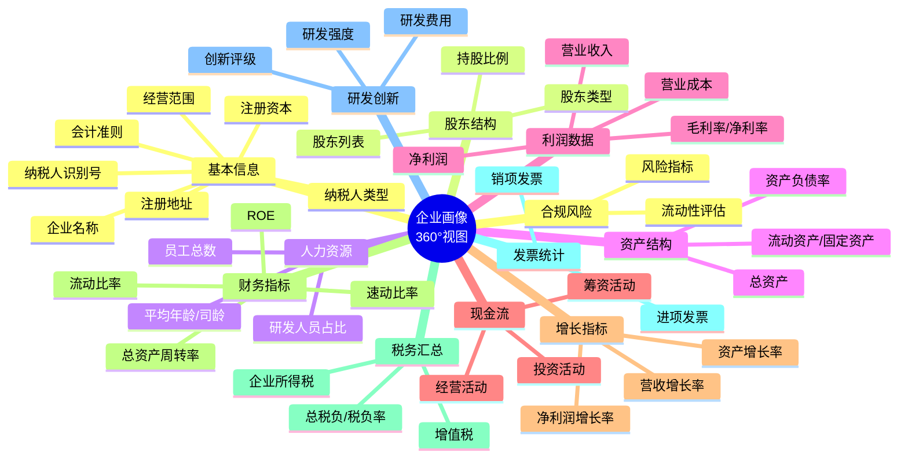
```mermaid
mindmap
  root((企业画像<br/>360°视图))
    基本信息
      企业名称
      纳税人识别号
      纳税人类型
      会计准则
      注册资本
      注册地址
      经营范围
    股东结构
      股东列表
      持股比例
      股东类型
    人力资源
      员工总数
      研发人员占比
      平均年龄/司龄
    资产结构
      总资产
      流动资产/固定资产
      资产负债率
    利润数据
      营业收入
      营业成本
      净利润
      毛利率/净利率
    现金流
      经营活动
      投资活动
      筹资活动
    增长指标
      营收增长率
      净利润增长率
      资产增长率
    财务指标
      ROE
      流动比率
      速动比率
      总资产周转率
    税务汇总
      增值税
      企业所得税
      总税负/税负率
    发票统计
      销项发票
      进项发票
    研发创新
      研发费用
      研发强度
      创新评级
    合规风险
      风险指标
      流动性评估
```

### 3.9 数据管理

#### 3.9.1 数据浏览器

支持10个可浏览数据域：

| 域名称 | 视图 | 展示模式 |
|-------|------|---------|
| 利润表 | vw_profit_eas/vw_profit_sas | 通用宽表/原始结构 |
| 资产负债表 | vw_balance_sheet_eas/sas | 通用宽表/双列资产负债 |
| 现金流量表 | vw_cash_flow_eas/sas | 通用宽表/原始结构 |
| 增值税 | vw_vat_return_general/small | 通用宽表/按字段分行 |
| 企业所得税年报 | vw_eit_annual_main | 通用宽表/原始结构 |
| 企业所得税季报 | vw_eit_quarter_main | 通用宽表/原始结构 |
| 科目余额 | vw_account_balance | 通用宽表 |
| 进项发票 | vw_inv_spec_purchase | 通用宽表 |
| 销项发票 | vw_inv_spec_sales | 通用宽表 |
| 财务指标 | vw_financial_metrics | 通用宽表 |

#### 3.9.2 数据质量检查

5大检查类别：

| 类别 | 检查项 | 示例 |
|-----|-------|------|
| **内部一致性** | 资产负债表等式、利润表公式、增值税计算 | 资产=负债+所有者权益 |
| **合理性** | 阈值检查、异常值检测 | 资产负债率<200% |
| **跨表勾稽** | 跨域数据一致性 | 利润表净利润=资产负债表未分配利润变动 |
| **期间连续性** | 月度数据缺口检测 | 检测缺失的月份 |
| **完整性** | 必填字段、关键数据缺失 | 纳税人名称非空 |

---

## 4. 数据与信息

### 4.1 数据库架构

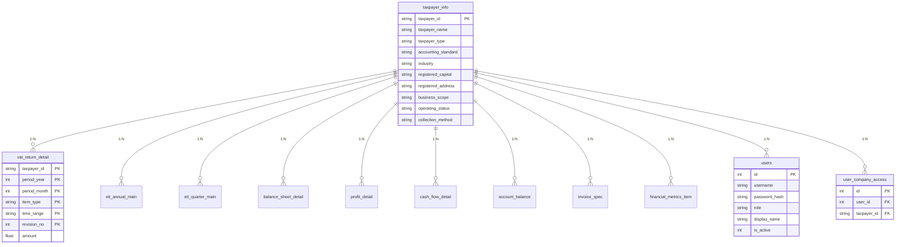
```mermaid
erDiagram
    taxpayer_info ||--o{ vat_return_detail : "1:N"
    taxpayer_info ||--o{ eit_annual_main : "1:N"
    taxpayer_info ||--o{ eit_quarter_main : "1:N"
    taxpayer_info ||--o{ balance_sheet_detail : "1:N"
    taxpayer_info ||--o{ profit_detail : "1:N"
    taxpayer_info ||--o{ cash_flow_detail : "1:N"
    taxpayer_info ||--o{ account_balance : "1:N"
    taxpayer_info ||--o{ invoice_spec : "1:N"
    taxpayer_info ||--o{ financial_metrics_item : "1:N"
    taxpayer_info ||--o{ users : "1:N"
    taxpayer_info ||--o{ user_company_access : "1:N"

    taxpayer_info {
        string taxpayer_id PK
        string taxpayer_name
        string taxpayer_type
        string accounting_standard
        string industry
        string registered_capital
        string registered_address
        string business_scope
        string operating_status
        string collection_method
    }

    vat_return_detail {
        string taxpayer_id PK
        int period_year PK
        int period_month PK
        string item_type PK
        string time_range PK
        int revision_no PK
        float amount
    }

    users {
        int id PK
        string username
        string password_hash
        string role
        string display_name
        int is_active
    }

    user_company_access {
        int id PK
        int user_id FK
        string taxpayer_id FK
    }
```

### 4.2 视图系统

系统采用**视图优先**策略，NL2SQL从不直接查询明细表。

**视图设计原则**：

1. **JOIN taxpayer_info**：所有视图关联纳税人基础信息
2. **最新版本过滤**：使用ROW_NUMBER()窗口函数自动选择最新revision_no
3. **类型区分**：财务报表按会计准则分视图（EAS/SAS），增值税按纳税人类型分视图
4. **列名规范化**：统一命名规范，便于跨域查询

**18个核心视图**：

| 视图名称 | 用途 | SQL结构特点 |
|---------|------|-----------|
| vw_vat_return_general | 一般纳税人增值税 | PIVOT转置item_type |
| vw_vat_return_small | 小规模纳税人增值税 | PIVOT转置item_type |
| vw_eit_annual_main | 企业所得税年报 | 关联股东表 |
| vw_eit_quarter_main | 企业所得税季报 | 季度累计数据 |
| vw_balance_sheet_eas | 资产负债表(企业会计准则) | PIVOT转置item_code |
| vw_balance_sheet_sas | 资产负债表(小企业准则) | PIVOT转置item_code |
| vw_profit_eas | 利润表(企业会计准则) | CROSS JOIN time_range |
| vw_profit_sas | 利润表(小企业准则) | CROSS JOIN time_range |
| vw_cash_flow_eas | 现金流量表(企业会计准则) | CROSS JOIN time_range |
| vw_cash_flow_sas | 现金流量表(小企业准则) | CROSS JOIN time_range |
| vw_account_balance | 科目余额表 | 借贷方向处理 |
| vw_inv_spec_purchase | 进项发票 | 过滤invoice_type |
| vw_inv_spec_sales | 销项发票 | 过滤invoice_type |
| vw_financial_metrics | 财务指标 | 聚合计算指标 |
| vw_enterprise_profile | 企业画像 | 跨域聚合视图 |

### 4.3 样本数据覆盖

| 企业名称 | 纳税人类型 | 会计准则 | 数据期间 | 行业特点 |
|----------|------------|----------|----------|----------|
| 华兴科技 | 一般纳税人 | 企业会计准则 | 2024.01-2026.02 | 科技制造业 |
| 鑫源贸易 | 小规模纳税人 | 小企业会计准则 | 2024.01-2026.02 | 贸易流通业 |
| 创智软件 | 一般纳税人 | 企业会计准则 | 2023.01-2025.12 | 软件服务业 |
| 大华智能制造 | 小规模纳税人 | 小企业会计准则 | 2023.01-2025.12 | 智能制造业 |
| TSE科技 | 一般纳税人 | 企业会计准则 | 2023.01-2025.12 | 高新技术 |
| 环球机械 | 小规模纳税人 | 小企业会计准则 | 2023.01-2025.12 | 机械制造业 |

### 4.4 税收优惠政策库

**独立数据库**：`tax_incentives.db`

| 属性 | 说明 |
|-----|------|
| 政策数量 | 1522条 |
| 索引方式 | FTS5全文索引 |
| 检索策略 | 四层渐进式回退 |

**表结构**：

```sql
CREATE TABLE tax_incentive_policies (
    policy_id TEXT PRIMARY KEY,
    policy_name TEXT NOT NULL,
    tax_type TEXT,           -- 税种
    incentive_category TEXT, -- 大类：减免类/抵扣类/优惠税率类
    incentive_subcategory TEXT,
    applicable_entity TEXT,  -- 适用对象
    applicable_industry TEXT,
    applicable_region TEXT,
    incentive_method TEXT,
    policy_content TEXT,
    legal_basis TEXT,
    effective_date TEXT,
    expiry_date TEXT
);

CREATE VIRTUAL TABLE tax_incentives_policies_fts USING fts5(
    policy_name,
    policy_content,
    content='tax_incentive_policies',
    content_rowid='rowid'
);
```

---

## 5. 关键技术实现

### 5.1 实体预处理

#### 5.1.1 纳税人识别

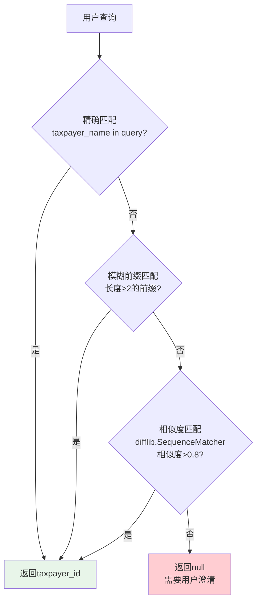
```mermaid
graph TD
    A[用户查询] --> B{精确匹配<br/>taxpayer_name in query?}

    B -->|是| C[返回taxpayer_id]
    B -->|否| D{模糊前缀匹配<br/>长度≥2的前缀?}

    D -->|是| C
    D -->|否| E{相似度匹配<br/>difflib.SequenceMatcher<br/>相似度>0.8?}

    E -->|是| C
    E -->|否| F[返回null<br/>需要用户澄清]

    style C fill:#e8f5e9
    style F fill:#ffcdd2
```

**纳税人识别规则**：

| 匹配方式 | 优先级 | 示例 |
|---------|--------|------|
| 精确匹配 | 1 | "华兴科技" 完全匹配 |
| 前缀匹配 | 2 | "华兴" → "华兴科技"（长度≥2） |
| 模糊匹配 | 3 | "华兴科技" 相似度>0.8 |

#### 5.1.2 期间解析

| 日期类型 | 表达方式 | 解析结果 |
|---------|---------|---------|
| 绝对日期 | 2025年1月、2025-01 | period_year=2025, period_month=1 |
| 相对日期-年 | 今年、去年 | 2026、2025 |
| 相对日期-月 | 上个月、本月 | 2026年2月、2026年1月 |
| 相对日期-季 | 上个季度 | 2026年Q1 |
| 范围表达 | 2024-2025年、近三个月 | period_year范围 |

#### 5.1.3 域检测优先级

| 优先级 | 数据域 | 检测关键词 | 区分特征 |
|-------|--------|-----------|---------|
| 1 | 财务指标 | 毛利率、ROE、资产负债率 | 关键词独特 |
| 2 | 现金流 | 经营活动现金流 | 无重叠 |
| 3 | 科目余额 | 期初余额、借方发生额 | 借贷标记 |
| 4 | 利润表 | 本期金额、本年累计 | 时间标记 |
| 5 | 资产负债表 | 年初余额、期初余额 | 时间标记 |
| 6 | 企业所得税 | 年度、季度 | 时间+税种 |
| 7 | 发票 | 发票、进项/销项 | 明确关键词 |
| 8 | 增值税 | 默认 | 最常见 |

### 5.2 SQL安全审计

多层防护机制确保查询安全：

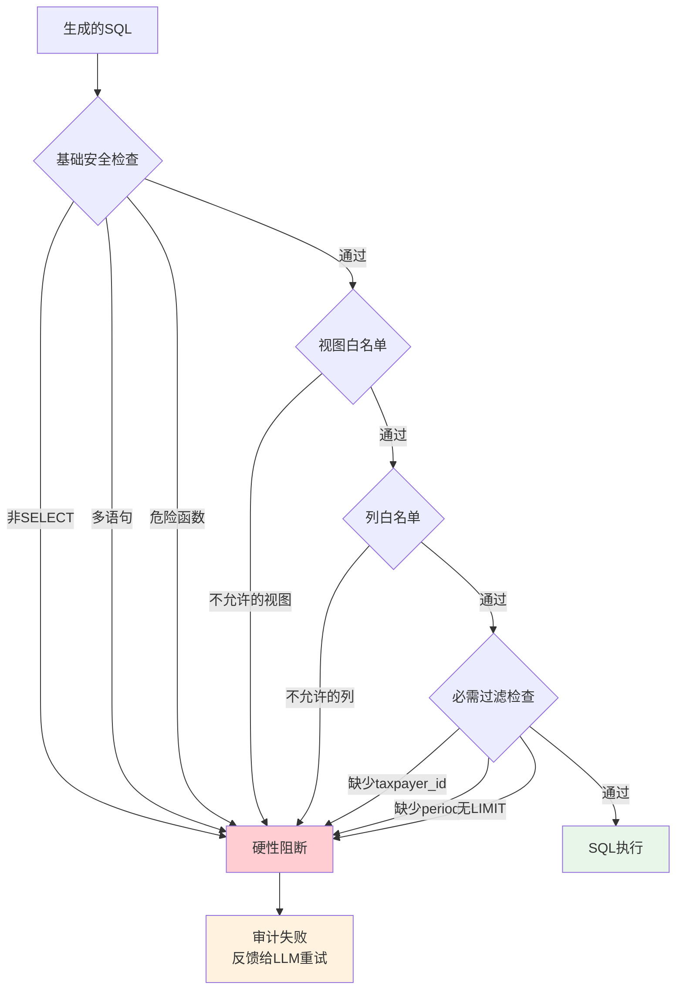
```mermaid
graph TD
    A[生成的SQL] --> B{基础安全检查}
    B -->|非SELECT| F[硬性阻断]
    B -->|多语句| F
    B -->|危险函数| F
    B -->|通过| C{视图白名单}

    C -->|不允许的视图| F
    C -->|通过| D{列白名单}

    D -->|不允许的列| F
    D -->|通过| E{必需过滤检查}

    E -->|缺少taxpayer_id| F
    E -->|缺少period| F
    E -->|无LIMIT| F
    E -->|通过| G[SQL执行]

    F --> H[审计失败<br/>反馈给LLM重试]

    style G fill:#e8f5e9
    style F fill:#ffcdd2
    style H fill:#fff3e0
```

**审计规则分类**：

| 类别 | 规则 | 处置 |
|-----|------|-----|
| 安全性 | 只允许SELECT | 硬性阻断 |
| 安全性 | 禁止危险函数 | 硬性阻断 |
| 数据安全 | 必须包含taxpayer_id | 硬性阻断 |
| 数据安全 | 必须包含LIMIT | 硬性阻断 |
| 视图白名单 | 必须在允许列表 | 硬性阻断 |
| 列白名单 | 必须在允许列表 | 硬性阻断 |
| 域特定 | EIT季报必须有period_quarter | 硬性阻断 |
| 域特定 | 月度域必须有period_month | 硬性阻断 |

### 5.3 双层缓存架构

```mermaid
graph TD
    subgraph "L1缓存 完整结果缓存"
        L1_1[缓存键: MD5<br/>company_id\|query\|mode]
        L1_2[存储位置<br/>cache/*.json]
        L1_3[命中率: 60-70%]
        L1_4[LRU: 最大1500文件]
    end

    subgraph "L2缓存 SQL模板缓存"
        L2_1[缓存键: 域感知策略]
        L2_2[存储位置<br/>cache/template_*.json]
        L2_3[命中率: 40-50%]
        L2_4[LRU: 最大600文件]
    end

    subgraph "缓存查找流程"
        Q[用户查询] --> L1[检查L1缓存]
        L1 -->|命中| R1[返回缓存结果<br/>⚡极速]
        L1 -->|未命中| L2[检查L2缓存]
        L2 -->|命中| R2[实例化SQL+执行<br/>🔄快速]
        L2 -->|未命中| P[完整Pipeline<br/>🔧]
        P --> L1
        P --> L2
    end

    style R1 fill:#4caf50,color:#fff
    style R2 fill:#8bc34a,color:#fff
    style P fill:#ff9800,color:#fff
```

**L2缓存键策略**：

| 数据域 | 缓存键组成 | 说明 |
|-------|-----------|------|
| 财务报表 | query\|mode\|fs\|accounting_standard | 按会计准则区分 |
| 增值税 | query\|mode\|vat\|taxpayer_type | 按纳税人类型区分 |
| 企业所得税 | query\|mode\|eit | 无需区分 |
| 跨域查询 | 各子域组合 | 最多4个模板 |

### 5.4 SSE流式输出

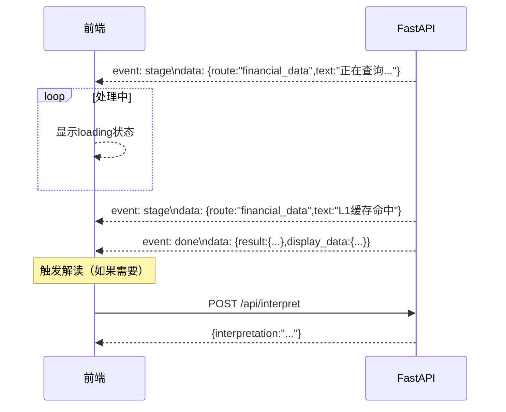
```mermaid
sequenceDiagram
    participant FE as 前端
    participant API as FastAPI

    API-->>FE: event: stage\ndata: {route:"financial_data",text:"正在查询..."}
    loop 处理中
        FE-->>FE: 显示loading状态
    end

    API-->>FE: event: stage\ndata: {route:"financial_data",text:"L1缓存命中"}

    API-->>FE: event: done\ndata: {result:{...},display_data:{...}}

    Note over FE: 触发解读（如果需要）
    FE->>API: POST /api/interpret
    API-->>FE: {interpretation:"..."}
```

### 5.5 同义词规范化

系统维护9个域特定的同义词表（300+映射规则）：

| 同义词表 | 映射数量 | 示例 |
|---------|---------|------|
| vat_synonyms | 150+ | 销项税额←销项税、销项、销售税额 |
| eit_synonyms | 80+ | 应纳税所得额←应税所得额、纳税所得 |
| fs_balance_sheet_synonyms | 200+ | 货币资金←现金、银行存款 |
| fs_income_statement_synonyms | 180+ | 营业收入←主营业务收入、销售收入 |
| fs_cash_flow_synonyms | 120+ | 经营活动现金流入←经营现金流入 |
| account_synonyms | 100+ | 期初余额←期初、年初余额 |
| invoice_synonyms | 50+ | 进项发票←购进发票、采购发票 |
| financial_metrics_synonyms | 60+ | 资产负债率←负债率、债务比率 |
| cross_domain_synonyms | 30+ | 同比←去年同期、上年同期 |

---

## 6. API接口文档

### 6.1 认证接口

#### 6.1.1 登录

```
POST /api/auth/login
```

**请求体**：

```json
{
    "username": "user1",
    "password": "123456"
}
```

**响应**：

```json
{
    "access_token": "eyJhbGciOiJIUzI1NiIsInR5cCI6IkpXVCJ9...",
    "token_type": "bearer",
    "user": {
        "id": 1,
        "username": "user1",
        "display_name": "用户1",
        "role": "firm"
    },
    "company_ids": ["HX001", "XY001"]
}
```

#### 6.1.2 验证码校验

```
POST /api/auth/captcha/verify
```

**请求体**：

```json
{
    "code": "123456"
}
```

**响应**：

```json
{
    "valid": true
}
```

### 6.2 对话接口

#### 6.2.1 发送消息（SSE流式）

```
POST /api/chat
```

**请求体**：

```json
{
    "query": "华兴科技2025年1月增值税",
    "response_mode": "detailed",
    "company_id": "HX001",
    "thinking_mode": "quick",
    "conversation_history": [
        {"role": "user", "content": "华兴科技2025年1月增值税"},
        {"role": "assistant", "content": "2025年1月华兴科技增值税销项税额为..."}
    ],
    "conversation_depth": 3
}
```

**SSE事件流**：

```
event: stage
data: {"route":"financial_data","text":"正在查询财务数据..."}

event: done
data: {"success":true,"results":[...],"display_data":{...},"interpretation":"..."}
```

### 6.3 企业画像接口

```
GET /api/profile/{taxpayer_id}?year=2025
```

**响应**：

```json
{
    "taxpayer_id": "HX001",
    "taxpayer_name": "华兴科技",
    "year": 2025,
    "basic_info": {...},
    "asset_structure": {...},
    "profit_data": {...},
    "cash_flow": {...},
    "financial_metrics": {...},
    "tax_summary": {...}
}
```

### 6.4 数据管理接口

#### 6.4.1 数据统计

```
GET /api/data-management/stats?company_id=HX001
```

#### 6.4.2 企业数据概览

```
GET /api/data-management/companies-overview
```

#### 6.4.3 质量检查

```
POST /api/data-management/quality-check
Content-Type: application/json

{
    "company_id": "HX001",
    "year": 2025
}
```

### 6.5 数据浏览器接口

#### 6.5.1 获取可浏览表

```
GET /api/data-browser/tables
```

#### 6.5.2 获取可用期间

```
GET /api/data-browser/periods?company_id=HX001&domain=vat
```

#### 6.5.3 获取数据

```
GET /api/data-browser/data?company_id=HX001&domain=vat&period=2025-01&mode=general
```

### 6.6 用户管理接口

| 方法 | 路径 | 说明 |
|-----|------|------|
| GET | /api/users | 获取用户列表 |
| POST | /api/users | 创建用户 |
| PUT | /api/users/{id} | 更新用户 |
| DELETE | /api/users/{id} | 删除用户 |
| GET | /api/users/{id}/companies | 获取用户公司权限 |
| PUT | /api/users/{id}/companies | 更新用户公司权限 |

### 6.7 仪表盘接口

```
GET /api/dashboard/summary?company_id=HX001
```

**响应**：

```json
{
    "health_score": 85,
    "health_level": "良好",
    "top_metrics": [
        {"name": "毛利率", "value": "25.6%", "level": "优秀"},
        {"name": "资产负债率", "value": "45.2%", "level": "良好"}
    ],
    "recent_activity": [
        {"query": "华兴科技2025年1月增值税", "timestamp": "2026-03-18T10:30:00"}
    ]
}
```

---

## 7. 用户场景与痛点解决

### 7.1 典型用户场景

#### 场景1：企业财务人员日常查询

**痛点**：
- 传统方式需要打开多个Excel文件
- 需要记忆复杂的报表结构
- 跨表查询需要手动关联
- 数据分散，难以快速获取答案

**FinTax AI解决方案**：
- 自然语言查询："华兴科技2025年1月增值税销项税额"
- 秒级响应，自动关联数据
- 图表可视化，趋势一目了然
- 支持多轮对话，连续追问

#### 场景2：税务顾问多客户管理

**痛点**：
- 管理多家客户，数据切换繁琐
- 需要对比不同客户的财税状况
- 税务筹划需要综合多方面信息
- 政策更新频繁，难以全面掌握

**FinTax AI解决方案**：
- 客户组合视图，一览所有客户健康状况
- 快速切换公司，无需重新登录
- 混合分析引擎，自动匹配政策与数据
- 1522条政策库，智能检索

#### 场景3：集团企业多子公司对比

**痛点**：
- 子公司数据分散在不同系统
- 跨公司对比需要手动整理
- 难以发现异常和风险
- 缺乏统一的数据质量标准

**FinTax AI解决方案**：
- 多企业数据对比功能
- 统一数据质量检查标准
- 批量质量检查，快速发现问题
- 健康评分排名，识别风险企业

#### 场景4：企业管理层决策支持

**痛点**：
- 财务报表专业性强，难以理解
- 需要快速了解企业经营状况
- 缺乏趋势分析和预警机制
- 决策依据不足

**FinTax AI解决方案**：
- 企业画像360度视图
- 健康评分卡，直观展示企业状况
- 增长指标自动计算
- LLM专业解读，通俗易懂

### 7.2 核心痛点解决矩阵

| 痛点 | 传统方式 | FinTax AI解决方案 | 技术实现 |
|-----|---------|------------------|---------|
| 专业门槛高 | 需要学习报表结构和税法 | 自然语言交互，零门槛 | NL2SQL + 同义词映射 |
| 数据分散 | 多系统、多文件切换 | 9大数据域统一整合 | 视图系统 + 跨域查询 |
| 响应速度慢 | 手动筛选、计算 | 秒级响应 | 双层缓存 + 确定性计算 |
| 缺乏智能分析 | 仅展示数据 | LLM专业解读 | 解读服务 + 7种场景适配 |
| 多轮交互难 | 每次查询独立 | 上下文继承 | 对话管理器 + 实体继承 |

---

## 8. 系统安全与权限

### 8.1 JWT认证流程

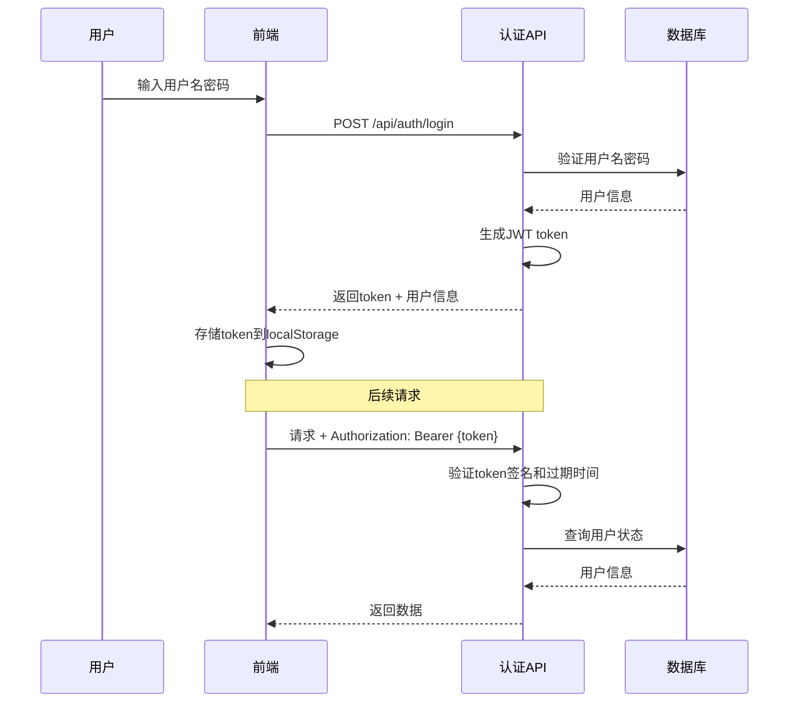
```mermaid
sequenceDiagram
    participant U as 用户
    participant FE as 前端
    participant API as 认证API
    participant DB as 数据库

    U->>FE: 输入用户名密码
    FE->>API: POST /api/auth/login
    API->>DB: 验证用户名密码
    DB-->>API: 用户信息
    API->>API: 生成JWT token
    API-->>FE: 返回token + 用户信息
    FE->>FE: 存储token到localStorage

    Note over FE,API: 后续请求
    FE->>API: 请求 + Authorization: Bearer {token}
    API->>API: 验证token签名和过期时间
    API->>DB: 查询用户状态
    DB-->>API: 用户信息
    API-->>FE: 返回数据
```

### 8.2 5级角色权限体系

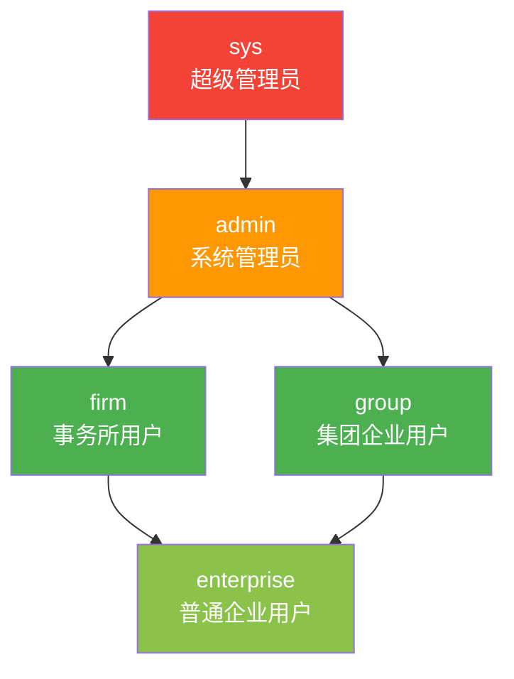
```mermaid
graph TD
    A[sys<br/>超级管理员] --> B[admin<br/>系统管理员]
    B --> C1[firm<br/>事务所用户]
    B --> C2[group<br/>集团企业用户]
    C1 --> D[enterprise<br/>普通企业用户]
    C2 --> D

    style A fill:#f44336,color:#fff
    style B fill:#ff9800,color:#fff
    style C1 fill:#4caf50,color:#fff
    style C2 fill:#4caf50,color:#fff
    style D fill:#8bc34a,color:#fff
```

**权限矩阵**：

| 功能 | sys | admin | firm | group | enterprise |
|------|-----|-------|------|-------|------------|
| 查看所有公司数据 | ✓ | ✓ | ✗ | ✗ | ✗ |
| 查看授权公司数据 | ✓ | ✓ | ✓ | ✓ | ✓ |
| 创建sys用户 | ✓ | ✗ | ✗ | ✗ | ✗ |
| 创建admin用户 | ✓ | ✓ | ✗ | ✗ | ✗ |
| 创建firm/group用户 | ✓ | ✓ | ✓ | ✓ | ✗ |
| 创建enterprise用户 | ✓ | ✓ | ✓ | ✓ | ✗ |
| 修改用户公司权限 | ✓ | ✓ | ✗ | ✗ | ✗ |
| 会话管理 | ✓ | ✓ | ✗ | ✗ | ✗ |
| 清除缓存 | ✓ | ✗ | ✗ | ✗ | ✗ |
| 数据质量检查 | ✓ | ✓ | ✓ | ✓ | ✓ |

### 8.3 数据安全措施

| 安全措施 | 实现方式 |
|---------|---------|
| SQL注入防护 | 参数化查询 + SQL审计 |
| XSS防护 | React自动转义 + CSP头部 |
| 密码安全 | bcrypt哈希（cost=12） |
| JWT安全 | HS256算法 + 24h过期 |
| 敏感信息保护 | 环境变量存储密钥 |
| 审计日志 | user_query_log表记录所有查询 |

---

## 9. 性能优化

### 9.1 缓存策略

| 缓存层级 | 命中率 | 响应时间 | 适用场景 |
|---------|--------|---------|---------|
| L1结果缓存 | 60-70% | <50ms | 重复查询 |
| L2模板缓存 | 40-50% | 200-500ms | 跨公司同类查询 |
| 确定性计算 | 无缓存 | 100-300ms | 指标/概念查询 |

### 9.2 数据库优化

| 优化项 | 说明 |
|-------|------|
| 索引策略 | 复合主键索引、外键索引、FTS5全文索引 |
| 视图优化 | ROW_NUMBER()窗口函数选择最新版本 |
| PIVOT转置 | 减少行数，提升查询效率 |
| 预计算聚合 | 财务指标视图预计算 |
| 参数化查询 | 复用执行计划 |

### 9.3 前端优化

| 优化项 | 说明 |
|-------|------|
| 代码分割 | React.lazy + Suspense |
| 虚拟滚动 | 历史记录列表 |
| 防抖节流 | 搜索输入 |
| 图表懒加载 | Chart.js按需加载 |

### 9.4 并发处理

| 层级 | 优化策略 |
|-----|---------|
| 前端并发 | Promise.all批量请求、AbortController取消 |
| 后端并发 | FastAPI异步、SQLite连接池、批量数据预取 |

---

## 10. 部署与配置

### 10.1 系统要求

| 组件 | 要求 |
|-----|------|
| CPU | 2核心以上 |
| 内存 | 4GB以上（推荐8GB） |
| 磁盘 | 10GB以上可用空间 |
| 网络 | 稳定互联网连接（访问LLM API） |
| Python | 3.9+ |
| Node.js | 16+（前端构建） |
| SQLite | 3.35+ |

### 10.2 环境变量配置

```bash
# JWT配置
JWT_SECRET_KEY="your-secret-key-here"

# LLM配置
LLM_API_KEY="your-deepseek-api-key"
LLM_API_BASE="https://api.deepseek.com"
LLM_MODEL="deepseek-chat"

# Coze RAG配置
COZE_PAT_TOKEN="your-coze-token"

# CORS配置
ALLOWED_ORIGINS="https://yourdomain.com"
```

### 10.3 启动脚本

```bash
# 后端启动
cd d:\fintax_ai
uvicorn api.main:app --host 0.0.0.0 --port 8000 --reload

# 前端开发
cd frontend
npm install
npm run dev

# 前端生产构建
cd frontend
npm run build
```

---

## 11. 系统维护与扩展

### 11.1 日常维护

#### 11.1.1 数据备份

```bash
# 数据库备份
cp database/fintax_ai.db database/backup/fintax_ai_$(date +%Y%m%d).db
cp database/tax_incentives.db database/backup/tax_incentives_$(date +%Y%m%d).db

# 缓存备份
tar -czf cache_backup_$(date +%Y%m%d).tar.gz cache/

# 历史记录备份
cp query_history.json backup/query_history_$(date +%Y%m%d).json
```

#### 11.1.2 缓存清理

```bash
# 清理L1缓存（保留最新1000个）
python -c "from api.services.query_cache import cleanup_cache; cleanup_cache(1000)"

# 清理L2缓存（保留最新400个）
python -c "from api.services.template_cache import cleanup_l2_cache; cleanup_l2_cache(400)"
```

### 11.2 扩展指南

#### 11.2.1 添加新数据域

1. **数据库层**：
   - 创建明细表（EAV或宽表结构）
   - 创建视图（JOIN taxpayer_info，ROW_NUMBER选择最新版本）
   - 添加索引

2. **配置层**：
   - 更新schema_catalog.py（添加视图和列白名单）
   - 创建Stage 2 prompt模板
   - 更新domain_prompt_map.json
   - 添加域检测关键词
   - 添加同义词映射

3. **代码层**：
   - 更新entity_preprocessor.py的域检测逻辑
   - 更新sql_auditor.py添加域特定规则
   - 更新display_formatter.py

#### 11.2.2 添加新财务指标

无需修改代码，只需编辑配置文件：

```json
// config/metrics/metric_formulas.json
{
    "新指标名称": {
        "label": "新指标",
        "unit": "%",
        "formula": "变量A / 变量B * 100",
        "sources": {
            "变量A": {"domain": "profit", "column": "营业收入"},
            "变量B": {"domain": "profit", "column": "营业成本"}
        }
    }
}
```

#### 11.2.3 扩展LLM提供商

系统使用OpenAI兼容接口，支持任何兼容提供商：

```python
# config/settings.py
LLM_API_BASE = "https://your-llm-provider.com/v1"
LLM_API_KEY = "your-api-key"
LLM_MODEL = "your-model-name"
```

### 11.3 监控与告警

**关键指标监控**：

| 指标类型 | 监控项 | 告警阈值 |
|---------|-------|---------|
| 响应时间 | P50/P95/P99 | P95>3s |
| 缓存命中率 | L1/L2命中率 | L1<50% |
| LLM成功率 | Stage1/Stage2成功率 | <90% |
| SQL审计通过率 | 首次通过率 | <80% |
| 错误率 | 按路由分类 | >5% |

---

## 12. 常见问题

### 12.1 查询问题排查

#### Q1: 查询结果为空

**可能原因**：
1. 查询期间没有数据（样本数据覆盖2023.01-2026.02）
2. 公司名称识别错误
3. 域检测错误

**解决方案**：
- 使用完整公司名称
- 检查查询期间是否在数据覆盖范围内
- 添加明确的域关键词（增值税、利润表等）

#### Q2: SQL审计失败

**可能原因**：
1. 缺少必需过滤条件（taxpayer_id、period）
2. 查询了不允许的视图
3. 缺少LIMIT子句

**解决方案**：
- LLM会自动重试一次
- 如仍失败，使用深度模式或调整查询

#### Q3: 多轮对话不生效

**可能原因**：
1. 未启用多轮对话开关
2. 不在beta用户白名单
3. 历史记录未正确传递

**解决方案**：
- 前端勾选"多轮对话"
- 联系管理员添加到白名单
- 刷新页面重试

### 12.2 性能问题排查

| 问题 | 可能原因 | 解决方案 |
|-----|---------|---------|
| 响应慢 | 使用深度模式 | 切换到快速/思考模式 |
| 响应慢 | 复杂跨域查询 | 拆分为多个简单查询 |
| 响应慢 | LLM服务延迟 | 等待或稍后重试 |
| 响应慢 | 缓存未命中 | 第二次查询会更快 |

### 12.3 权限问题排查

| 错误码 | 含义 | 解决方案 |
|-------|------|---------|
| 401 | 未登录或token过期 | 重新登录 |
| 403 | 无公司访问权限 | 联系管理员分配权限 |
| 403 | 角色权限不足 | 联系管理员提升权限 |

---

## 附录

### A. 术语表

| 术语 | 说明 |
|-----|------|
| NL2SQL | Natural Language to SQL，自然语言转SQL |
| EAV | Entity-Attribute-Value，实体-属性-值数据模型 |
| SSE | Server-Sent Events，服务器推送事件 |
| LRU | Least Recently Used，最近最少使用缓存策略 |
| FTS5 | Full-Text Search 5，SQLite全文搜索第5版 |
| JWT | JSON Web Token，JSON格式的令牌认证 |
| RAG | Retrieval-Augmented Generation，检索增强生成 |
| GAAP | Generally Accepted Accounting Principles，会计准则 |
| EAS | Enterprise Accounting Standards，企业会计准则 |
| SAS | Small Enterprise Accounting Standards，小企业会计准则 |

### B. 文件结构

```
d:\fintax_ai\
├── api/                    # FastAPI应用
│   ├── routes/            # 路由模块
│   │   ├── auth.py       # 认证路由
│   │   ├── chat.py       # 对话路由
│   │   ├── company.py    # 企业路由
│   │   ├── profile.py    # 画像路由
│   │   ├── data_browser.py
│   │   ├── data_management.py
│   │   ├── dashboard.py
│   │   ├── history.py
│   │   ├── interpret.py
│   │   ├── users.py
│   │   └── cache_stats.py
│   ├── services/          # 业务服务
│   └── main.py           # 入口
├── modules/              # 核心业务模块
│   ├── intent_router.py  # 意图路由
│   ├── intent_parser.py  # 意图解析
│   ├── entity_preprocessor.py  # 实体预处理
│   ├── sql_writer.py     # SQL生成
│   ├── sql_auditor.py    # SQL审计
│   ├── metric_calculator.py    # 指标计算
│   ├── concept_registry.py     # 概念注册表
│   ├── cross_domain_calculator.py  # 跨域计算
│   ├── display_formatter.py   # 展示格式化
│   ├── interpretation_service.py  # 解读服务
│   ├── conversation_manager.py  # 对话管理
│   ├── mixed_analysis_detector.py  # 混合分析检测
│   └── mixed_analysis_executor.py  # 混合分析执行
├── config/               # 配置文件
│   ├── settings.py       # 主配置
│   ├── tax_query_config.json  # 路由配置
│   ├── concepts/         # 概念定义
│   ├── domain_detection/  # 域检测
│   └── metrics/          # 指标定义
├── database/             # 数据库
│   ├── fintax_ai.db     # 主库
│   ├── tax_incentives.db # 政策库
│   └── script/           # 数据库脚本
├── frontend/             # React前端
│   └── src/
│       ├── components/   # 组件
│       ├── hooks/        # 自定义Hooks
│       ├── services/     # API服务
│       └── App.jsx       # 主组件
├── cache/                # 缓存目录
├── logs/                 # 日志目录
└── prompts/              # Prompt模板
```

### C. 版本历史

| 版本 | 日期 | 更新内容 |
|-----|------|---------|
| 1.0 | 2026-01-01 | 初始版本，核心NL2SQL功能 |
| 2.0 | 2026-03-18 | 四路由架构、混合分析、双层缓存 |

---

**文档版本**：2.0
**最后更新**：2026年3月18日
**文档作者**：FinTax AI 开发团队
